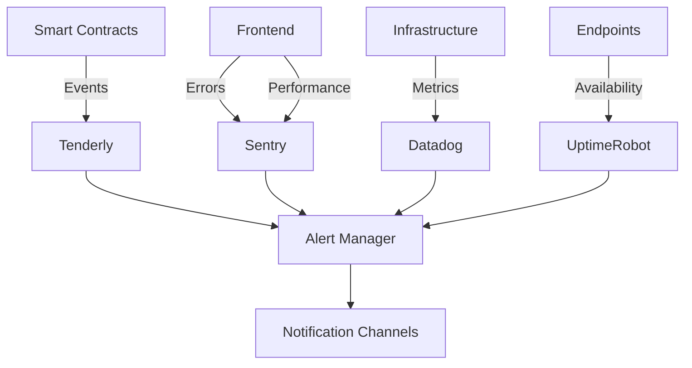

# Enterprise-Grade Monitoring & Alerting System

## Overview
GhostWriter implements a comprehensive, enterprise-grade monitoring and alerting system that provides:
- End-to-end observability across smart contracts and frontend
- Proactive alerting for critical issues
- Performance optimization insights
- Security threat detection
- Compliance and audit capabilities

## System Architecture



## Components

### 1. Tenderly (Smart Contract Monitoring)
- Real-time contract event monitoring with severity levels
- Transaction tracing and gas analytics
- Custom alert conditions and thresholds
- Integration with enterprise notification systems

📚 **[Setup Guide](./tenderly-setup.md)** | 🚨 **[Alert Rules](./alerting-rules.md#smart-contracts-tenderly)**

### 2. Sentry (Frontend Error Tracking)
- Real-time error reporting with user context
- Performance monitoring and transaction tracing
- Session replay for debugging
- Release tracking and source maps

📚 **[Setup Guide](./sentry-setup.md)** | 🚨 **[Alert Rules](./alerting-rules.md#frontend-sentry)**

### 3. UptimeRobot (Availability Monitoring)
- HTTP(s) endpoint monitoring with SSL checks
- Response time tracking and latency measurement
- Public status page for transparency
- Multi-region monitoring

🚨 **[Alert Rules](./alerting-rules.md#availability-uptimerobot)**

### 4. Datadog (Infrastructure Monitoring)
- Server metrics and resource utilization
- Log aggregation and analysis
- Application Performance Monitoring (APM)
- Custom dashboards and SLO tracking

🚨 **[Alert Rules](./alerting-rules.md#infrastructure-datadog)**

## Alerting Framework

### Severity Matrix
| Severity | Response Time | Escalation Path | Notification Channels |
|----------|---------------|------------------|-----------------------|
| **P0 - Critical** | Immediate (24/7) | On-call → Engineering Lead → CTO | Slack #critical-alerts, PagerDuty, SMS, Email |
| **P1 - Warning** | Business hours | Engineering Team → Team Lead | Slack #alerts, Email |
| **P2 - Informational** | Next business day | Team Lead | Email, Weekly digest |

📖 **[Complete Alerting Rules](./alerting-rules.md)**

## Setup & Configuration

### Prerequisites
- Node.js 18+
- Next.js 14+
- All required environment variables configured
- Monitoring system accounts (Sentry, Tenderly, Datadog, UptimeRobot)

### Installation & Setup
1. **Configure environment variables** (see `.env.example`)
2. **Set up Sentry** ([setup guide](./sentry-setup.md))
3. **Configure Tenderly alerts** ([setup guide](./tenderly-setup.md))
4. **Deploy infrastructure monitoring**
5. **Configure UptimeRobot checks**
6. **Verify all integrations**

### Deployment
```bash
# Set up Tenderly alerts
npm run setup:tenderly

# Verify monitoring setup
npm run test:monitoring
```

## Testing & Validation

📋 **[Comprehensive Testing Guide](./testing-guide.md)**

- **Sentry Testing**: Error tracking, performance monitoring, user feedback
- **Tenderly Testing**: Contract events, transaction alerts, severity levels
- **Alert Validation**: Notification channels, escalation paths
- **End-to-End Testing**: Complete user journeys and failure scenarios
- **Load Testing**: Performance under high traffic

## Best Practices

1. **Alert Hygiene**:
   - Regularly review and tune alert thresholds
   - Eliminate false positives and noise
   - Document all alerts and runbooks

2. **Observability**:
   - Instrument all critical user journeys
   - Capture business metrics alongside technical metrics
   - Implement distributed tracing

3. **Incident Response**:
   - Maintain up-to-date runbooks for all alerts
   - Conduct regular incident response drills
   - Implement post-mortem process for all incidents

4. **Performance**:
   - Set performance budgets for critical flows
   - Monitor and optimize gas usage
   - Implement SLOs for key metrics

5. **Security**:
   - Monitor for suspicious contract interactions
   - Alert on admin function calls
   - Implement anomaly detection

## Troubleshooting

| Issue | Solution |
|-------|----------|
| Alerts not triggering | Verify configuration and test with synthetic events |
| High false positives | Adjust thresholds and add filtering conditions |
| Missing context | Enhance instrumentation and error capture |
| Notification failures | Test notification channels and check integrations |
| Performance issues | Review sampling rates and adjust instrumentation |

## Maintenance

- **Monthly**: Review alert thresholds and runbooks
- **Quarterly**: Comprehensive system testing and false positive analysis
- **Annually**: Architecture review and technology evaluation