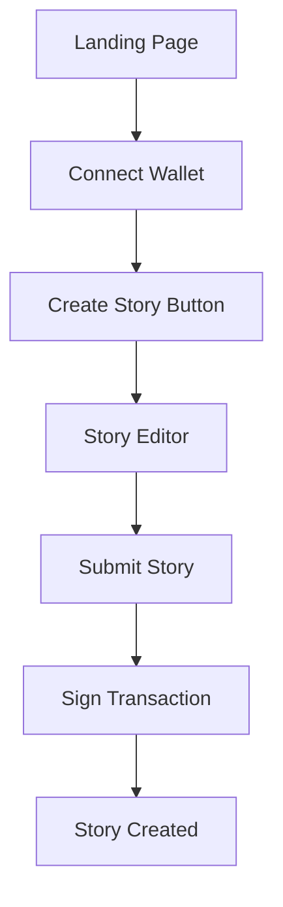
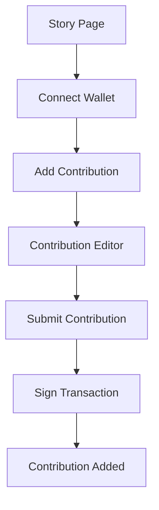
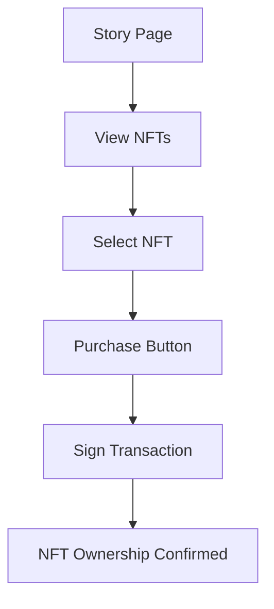

# Frontend Monitoring Metrics

## Core Metrics

### 1. Performance Metrics
| Metric                     | Description                                  | Target Value                  | Alert Threshold               | Collection Method          |
|----------------------------|----------------------------------------------|-------------------------------|-------------------------------|-----------------------------|
| Page Load Time             | Time to full page load (TTFB + content)      | <2s                           | >3s for >5% of users         | Sentry Performance           |
| First Contentful Paint     | Time to first content render                 | <1.5s                         | >2.5s for >5% of users       | Sentry + Lighthouse         |
| Time to Interactive        | Time until page is fully interactive         | <3s                           | >5s for >5% of users         | Sentry Performance           |
| API Response Time          | Average API response time                    | <500ms                        | >1s for >10% of requests     | Sentry + Custom Instrumentation |
| Wallet Connection Time     | Time to connect wallet                       | <2s                           | >4s for >5% of users         | Custom Instrumentation       |
| Transaction Submission Time| Time to submit blockchain transaction        | <5s                           | >10s for >5% of transactions | Custom Instrumentation       |

### 2. Error Metrics
| Metric                     | Description                                  | Target Value                  | Alert Threshold               | Collection Method          |
|----------------------------|----------------------------------------------|-------------------------------|-------------------------------|-----------------------------|
| Error Rate                 | Percentage of sessions with errors           | <0.5%                         | >1% of sessions              | Sentry                      |
| Unhandled Exceptions       | Uncaught JavaScript exceptions               | 0                             | >5 in 5 minutes              | Sentry                      |
| Failed API Requests        | Percentage of failed API calls               | <1%                           | >5% of requests              | Sentry + Custom Instrumentation |
| Wallet Connection Failures | Failed wallet connection attempts            | <1%                           | >3% of attempts              | Custom Instrumentation       |
| Transaction Failures       | Failed blockchain transactions               | <2%                           | >5% of transactions          | Custom Instrumentation       |
| 4xx/5xx Errors             | HTTP client/server errors                    | <0.1%                         | >1% of requests              | Sentry                      |

### 3. User Engagement Metrics
| Metric                     | Description                                  | Target Value                  | Alert Threshold               | Collection Method          |
|----------------------------|----------------------------------------------|-------------------------------|-------------------------------|-----------------------------|
| Daily Active Users         | Unique users per day                         | N/A                           | <50% of 30-day average       | Google Analytics + Custom   |
| Session Duration           | Average user session duration                | >3 minutes                    | <1 minute                    | Google Analytics            |
| Bounce Rate                | Percentage of single-page sessions            | <40%                          | >60%                         | Google Analytics            |
| Feature Usage              | Usage of key features (stories, NFTs, etc.)  | N/A                           | <30% of normal usage        | Custom Instrumentation       |
| Wallet Connections         | Number of wallet connections                 | N/A                           | <50% of 24h average         | Custom Instrumentation       |
| Transactions               | Number of blockchain transactions            | N/A                           | <30% of 24h average         | Custom Instrumentation       |

### 4. Stability Metrics
| Metric                     | Description                                  | Target Value                  | Alert Threshold               | Collection Method          |
|----------------------------|----------------------------------------------|-------------------------------|-------------------------------|-----------------------------|
| Crash-Free Sessions        | Percentage of sessions without crashes       | >99.5%                        | <99%                         | Sentry                      |
| Memory Usage               | Client-side memory consumption               | <500MB                        | >800MB for >5% of users      | Custom Instrumentation       |
| CPU Usage                  | Client-side CPU consumption                  | <30%                          | >50% for >5% of users        | Custom Instrumentation       |
| Browser Support            | Errors by browser/version                    | N/A                           | >1% error rate for any browser| Sentry                      |
| Device Support             | Errors by device type                        | N/A                           | >1% error rate for any device | Sentry                      |

## Critical User Flows

### 1. Story Creation Flow

**Monitoring Points:**
- Wallet connection success rate
- Story editor load time
- Transaction submission success rate
- Story creation confirmation

### 2. Contribution Flow

**Monitoring Points:**
- Contribution editor load time
- Transaction submission success rate
- Contribution confirmation
- NFT minting success rate

### 3. NFT Purchase Flow

**Monitoring Points:**
- NFT display performance
- Purchase button responsiveness
- Transaction success rate
- NFT ownership verification

## Dashboard Requirements

### 1. Real-Time Dashboard (Sentry)
- **Error Overview**: Current error rate and trends
- **Performance Metrics**: Current load times and trends
- **Active Issues**: Open issues with severity and status
- **User Impact**: Number of affected users
- **Geographic Distribution**: Errors by region
- **Browser/Device Breakdown**: Errors by client type

### 2. Historical Dashboard (Datadog)
- **30-Day Performance Trends**: Page load times, API response times
- **User Growth**: Daily/weekly active users
- **Feature Adoption**: Usage of key features over time
- **Error Trends**: Error rates and types over time
- **Stability Metrics**: Crash-free sessions, memory usage
- **Conversion Funnel**: User flow completion rates

### 3. Business Dashboard (Google Analytics)
- **Traffic Sources**: Where users are coming from
- **User Demographics**: Geographic and device distribution
- **Behavior Flow**: Common user paths through the application
- **Retention Rates**: User return rates
- **Conversion Rates**: Key action completion rates

## Alerting Rules

### 1. Critical Alerts (P0)
- **JavaScript Errors**: Unhandled exceptions affecting >5% of users
- **API Failures**: >20% of API requests failing for >5 minutes
- **Wallet Connection Failures**: >10% of connection attempts failing
- **Transaction Failures**: >15% of blockchain transactions failing
- **Page Load Failures**: >5% of page loads resulting in errors

### 2. Warning Alerts (P1)
- **Performance Degradation**: Page load times >3s for >10% of users
- **Increased Error Rates**: Error rates >1% of sessions
- **Feature Failures**: Key features (story creation, NFT minting) failing >5% of attempts
- **API Latency**: API response times >1s for >10% of requests
- **Wallet Connection Latency**: Connection times >4s for >10% of attempts

### 3. Informational Alerts (P2)
- **Daily Active Users**: <50% of 30-day average
- **Feature Usage**: <70% of normal usage for any key feature
- **Weekly Error Report**: Summary of frontend errors
- **Performance Trends**: Weekly performance metrics
- **User Feedback**: Aggregated user feedback and ratings